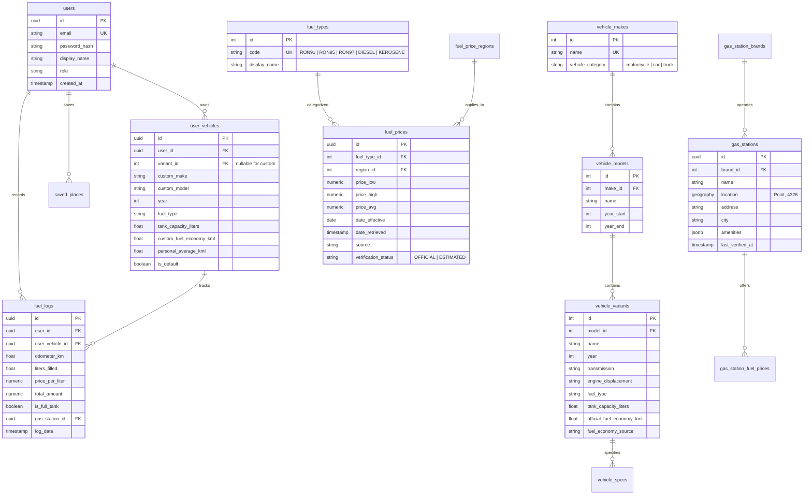

# CarGasPh — System Architecture & Technical Planning

> **Author**: Lead Systems & Mobile Architect  
> **Status**: APPROVED FOR IMPLEMENTATION (Phase 0 Complete)  
> **Version**: 1.0.0  
> **Date**: 2026-09-30  
> **Target Market**: Philippines (Motorcycles, Passenger Cars, SUVs, MPVs, Pickups, Vans)

---

## Table of Contents

1. [Executive Summary & Problem Statement](#1-executive-summary--problem-statement)
2. [Target Users & Persona Profiles](#2-target-users--persona-profiles)
3. [Scope of Application](#3-scope-of-application)
   - 3.1 MVP Scope (Phase 1–8)
   - 3.2 Post-MVP & Future Scope (Phase 9–15+)
4. [Requirements Matrix](#4-requirements-matrix)
   - 4.1 Functional Requirements (FR)
   - 4.2 Non-Functional Requirements (NFR)
5. [System Architecture Overview](#5-system-architecture-overview)
6. [Mobile Client Architecture (React Native / Expo)](#6-mobile-client-architecture-react-native--expo)
7. [Backend Service Architecture (FastAPI)](#7-backend-service-architecture-fastapi)
8. [Database Schema & PostGIS Architecture](#8-database-schema--postgis-architecture)
9. [Map & Navigation Architecture](#9-map--navigation-architecture)
10. [Philippine Fuel Intelligence Architecture](#10-philippine-fuel-intelligence-architecture)
    - 10.1 Authoritative Data Ingestion (DOE-OIMB)
    - 10.2 Fuel Movement Tracker & Predictive Rollback/Hike
    - 10.3 Data Trust & Verification Model
11. [Vehicle & Motorcycle Database Strategy](#11-vehicle--motorcycle-database-strategy)
12. [Fuel Consumption & Trip Cost Calculation Engine](#12-fuel-consumption--trip-cost-calculation-engine)
13. [Gas Station Discovery & Spatial Caching](#13-gas-station-discovery--spatial-caching)
14. [Fuel News & Advisory Aggregation](#14-fuel-news--advisory-aggregation)
15. [Push Notification & Alert System](#15-push-notification--alert-system)
16. [Security, Privacy & Data Governance](#16-security-privacy--data-governance)
17. [Google Maps Cost Control & Optimization Strategy](#17-google-maps-cost-control--optimization-strategy)
18. [Offline-First & Graceful Degradation Strategy](#18-offline-first--graceful-degradation-strategy)
19. [Infrastructure, Hosting & Deployment Pipeline](#19-infrastructure-hosting--deployment-pipeline)
20. [App Store & Google Play Compliance Guide](#20-app-store--google-play-compliance-guide)
21. [Estimated Operating Cost Analysis](#21-estimated-operating-cost-analysis)
22. [Risks, Constraints & Mitigation Strategies](#22-risks-constraints--mitigation-strategies)
23. [Phase-by-Phase Implementation Roadmap](#23-phase-by-phase-implementation-roadmap)

---

## 1. Executive Summary & Problem Statement

### 1.1 The Filipino Motorist Dilemma
In the Philippines, navigating daily traffic is not merely a matter of finding the fastest route; it is an economic equation. Fuel prices fluctuate weekly under the Downstream Oil Industry Deregulation Act (Republic Act 8479). On any given Tuesday, fuel prices can spike or roll back by ₱0.50 to ₱2.50+ per liter. Furthermore, traffic congestion in Metro Manila (EDSA, C5, Commonwealth) and major provincial arteries (SLEX, NLEX, MacArthur Highway) drastically worsens real-world fuel consumption compared to manufacturer-rated laboratory figures.

Existing tools operate in silos:
- **Navigation Apps (Google Maps, Waze)**: Provide turn-by-turn routing and ETA, but possess zero awareness of vehicle fuel consumption rates, fuel tank capacities, fuel requirements, or direct monetary trip costs.
- **Social Media / News Outlets**: Report weekly fuel adjustments ("Oil price hike: Gasoline up by ₱1.20, Diesel down by ₱0.70"), but motorists cannot automatically apply these rates to their specific garage vehicles or planned routes.
- **Fuel Tracking Apps (Drivvo, Fuelly)**: Act as manual offline expense logbooks without integrated GPS routing, route cost projection, or localized Philippine pump pricing.

### 1.2 The CarGasPh Solution
**CarGasPh** unifies these domains into a single intelligent platform:

$$\text{CarGasPh} = \text{Navigation} + \text{Vehicle Garage} + \text{Fuel Intelligence} + \text{Trip Cost Engine} + \text{Gas Station Finder} + \text{Fuel News}$$

Before embarking on a trip (e.g., Quezon City to Tagaytay, 74 km), a motorist will know:
1. **Distance & ETA**: 74 km, 2 hours 15 minutes.
2. **Vehicle Compatibility**: 2026 Yamaha Aerox 155 (Gasoline RON 91/95) vs. Toyota Vios 1.3E.
3. **Exact Fuel Needed**: $74\text{ km} / 40\text{ km/L} = 1.85\text{ Liters}$.
4. **Out-of-Pocket Expense**: $1.85\text{ L} \times ₱62.00/\text{L} = ₱114.70$ (One-way) or $₱229.40$ (Round-trip).
5. **Fuel Range Safety**: Vehicle has 2.2L remaining ($88\text{ km}$ range) $\rightarrow$ Fuel stop recommended before ascent.
6. **Station Opportunities**: Nearby Shell, Petron, and Cleanfuel stations with operating amenities.

---

## 2. Target Users & Persona Profiles

| Persona | Vehicle Type | Primary Pain Point | Core App Value |
|---|---|---|---|
| **Courier / Delivery Rider** (Grab, Lalamove, Foodpanda) | Motorcycle (Honda Click 125, Yamaha Mio, Aerox 155) | Narrow margins, high daily mileage (100–180 km/day), sensitive to ₱0.50 fuel fluctuations. | Accurate Cost-per-Kilometer ($\text{CPK} \approx ₱1.40/\text{km}$), real-world fuel logs, weekly hike notifications to gas up on Mondays. |
| **Daily Metro Commuter** | Compact Car / Sedan (Toyota Vios, Mitsubishi Mirage G4, Honda City) | Stop-and-go EDSA traffic degrading fuel economy from 15 km/L down to 8.5 km/L; unpredictable monthly expense. | Trip fuel calculator using personalized moving averages; Home-to-Work commute budget tracking. |
| **Provincial / Long-Haul Driver** | SUV / MPV / Pickup (Toyota Fortuner, Hilux, Isuzu D-Max, Mitsubishi Montero) | Long trips (150–400 km) through provincial tollways; needing to know if fuel tank will reach destination without premium tollway fuel markups. | Range vs. Route verification; Gas stations along route; Diesel rollback planning. |
| **Fleet / Small Business Manager** | Multi-vehicle garage (Vans, L300, Light Trucks) | Tracking multiple driver expenses and verifying legitimate gas claims. | Vehicle comparison tool; historical fuel price archive; exportable fuel logs. |

---

## 3. Scope of Application

### 3.1 MVP Scope (Phases 1 to 8)
- **Authentication**: Email/Password, JWT auth with secure token storage (`expo-secure-store`).
- **Vehicle Garage**: Full CRUD for user vehicles; support for Car and Motorcycle profiles; Default vehicle toggle; Manual specification of tank capacity and fuel economy.
- **Preloaded Philippine Vehicle Database**: Curated dataset of top 50 Philippine cars and top 30 Philippine motorcycles with verified baseline fuel economy (km/L).
- **Map & Routing**: Google Maps integration (foreground GPS location, Place search autocomplete, destination routing, polyline display, distance in km, duration).
- **Philippine Fuel Price Engine**: Weekly Department of Energy (DOE) prevailing prices by product (RON 91, RON 95, RON 97+, Diesel, Kerosene) and region (Metro Manila initial baseline).
- **Weekly Price Movement Display**: Visual indicators (Price Hike $\uparrow$, Rollback $\downarrow$, Unchanged $\leftrightarrow$) with effective dates.
- **Trip Cost Calculator**: Automatic computation of Liters Required, Estimated Fuel Cost (One-Way and Round-Trip), Cost-per-Kilometer ($\text{CPK}$) based on active route and selected vehicle.
- **Gas Station Discovery**: Nearby gas stations (Petron, Shell, Caltex, Cleanfuel, Seaoil, Unioil, Phoenix) within 5km of user location or destination.
- **Fuel News Digest**: Curated feed of official DOE advisories and verified Philippine motoring news summaries with thumbnail, metadata, and source URLs.

### 3.2 Post-MVP & Future Scope (Phases 9 to 15+)
- Turn-by-turn live navigation voice guidance (evaluating Google Navigation SDK vs. Mapbox vs. Waze deeplinking).
- Crowdsourced station-level pump prices with photo receipt OCR and GPS proximity validation.
- OBD-II Bluetooth scanner integration for automatic real-time telemetry extraction.
- Toll fee calculation integrated into total trip cost (SLEX, NLEX, SCTEX, CAVITEX, Skyway Stage 3).
- Multi-stop route optimization with optimal gas stop recommendations (identifying cheapest fuel along corridor).
- Web-based administrative portal for data curation and moderation.

---

## 4. Requirements Matrix

### 4.1 Functional Requirements (FR)

```text
[FR-01] USER MANAGEMENT
        FR-01.1: System shall register users with email, password, and display name.
        FR-01.2: System shall authenticate users via JWT (Access + Refresh tokens).
        FR-01.3: System shall allow session restoration and password reset requests.

[FR-02] VEHICLE GARAGE
        FR-02.1: Users can add multiple vehicles (Motorcycle, Car, SUV, MPV, Pickup, Van).
        FR-02.2: Users can select from pre-populated Philippine database or enter custom specs.
        FR-02.3: Each vehicle specifies Make, Model, Year, Variant, Fuel Type (RON 91, RON 95, Diesel, etc.),
                 Tank Capacity (L), and Baseline Fuel Economy (km/L).
        FR-02.4: System shall allow designating one vehicle as "Active/Default".

[FR-03] FUEL PRICING & MOVEMENTS
        FR-03.1: System shall display prevailing Philippine fuel prices for Gasoline (91, 95, 97+), Diesel, Kerosene.
        FR-03.2: System shall track and display weekly price changes (₱/L delta, effective date, direction).
        FR-03.3: Every displayed price must render its Source (e.g., "DOE Metro Manila Monitoring"), 
                 Effective Date, and Verification Status.
        FR-03.4: System shall archive historical weekly prices and provide 1M, 3M, 6M, 1Y price movement charts.

[FR-04] MAP & ROUTE ENGINE
        FR-04.1: App shall render interactive map centered on user GPS coordinate.
        FR-04.2: App shall provide search autocomplete for Philippine addresses, landmarks, and establishments.
        FR-04.3: App shall calculate driving route polyline, distance in kilometers, and estimated duration.
        FR-04.4: App shall support alternative route selection where provided by routing API.

[FR-05] FUEL CONSUMPTION & COST ESTIMATOR
        FR-05.1: Upon route calculation, app shall compute: Liters Used = Distance (km) / Fuel Economy (km/L).
        FR-05.2: App shall compute: Fuel Cost = Liters Used × Applicable Fuel Price (₱/L).
        FR-05.3: App shall support toggle between One-Way and Round-Trip computations.
        FR-05.4: App shall calculate Cost Per Kilometer (CPK = Fuel Price / Fuel Economy).
        FR-05.5: App shall calculate Range Warning if Route Distance > (Estimated Remaining Fuel × km/L).

[FR-06] GAS STATION DISCOVERY
        FR-06.1: App shall query and display gas stations within a 5km radius of user or along route corridor.
        FR-06.2: App shall display Station Brand (Petron, Shell, Caltex, etc.), Address, Distance, and ETA.
        FR-06.3: Station details shall display amenities (24/7, Air/Water, Restroom, Convenience Store) if known.

[FR-07] FUEL NEWS & ADVISORIES
        FR-07.1: App shall display list of latest fuel-related news, price movement advisories, and oil trends.
        FR-07.2: Each entry contains Title, Summary (<200 chars), Source Name, Publish Date, Source URL, Thumbnail.

[FR-08] FUEL LOG & PERSONAL ECONOMY
        FR-08.1: Users can record fill-up events: Odometer, Liters, Price/Liter, Total Cost, Station, Full Tank (Y/N).
        FR-08.2: System calculates actual trip km/L: (Current Odo - Last Odo) / Liters.
        FR-08.3: System calculates running rolling average km/L and updates trip estimator when confidence threshold (>= 3 logs) is met.
```

### 4.2 Non-Functional Requirements (NFR)

```text
[NFR-01] PERFORMANCE & LATENCY
         NFR-01.1: Map screen initial tile render < 1.5 seconds on 4G LTE.
         NFR-01.2: Route cost recalculation < 100 milliseconds upon receiving route distance.
         NFR-01.3: Backend API p95 response time < 250 milliseconds for cached endpoints.

[NFR-02] RELIABILITY & AVAILABILITY
         NFR-02.1: 99.5% backend uptime.
         NFR-02.2: Graceful offline handling: Cached vehicles, last-known fuel prices, and recent fuel logs
                   must remain accessible without internet.

[NFR-03] SECURITY & DATA PROTECTION
         NFR-03.1: All mobile-backend communication must use TLS 1.3.
         NFR-03.2: Passwords hashed with bcrypt (work factor 12) or Argon2id.
         NFR-03.3: JWT stored in iOS Keychain / Android Keystore via Expo SecureStore.
         NFR-03.4: Third-party private API keys (Google Maps Server key, etc.) NEVER embedded in mobile bundle.

[NFR-04] COST EFFICIENCY
         NFR-04.1: Google Maps Places Autocomplete session tokens strictly enforced.
         NFR-04.2: Nearby gas stations spatially cached in PostgreSQL with 7-day TTL to minimize Google Places API hits.

[NFR-05] BATTERY & DATA USAGE
         NFR-05.1: Foreground GPS polling throttled to balanced accuracy when vehicle is stationary.
         NFR-05.2: Zero background location tracking in MVP to protect user privacy and battery life.
```

---

## 5. System Architecture Overview

```
 ┌────────────────────────────────────────────────────────────────────────┐
 │                      MOBILE APPLICATION (React Native / Expo)           │
 │  ┌────────────────┐  ┌────────────────┐  ┌───────────────┐  ┌───────┐  │
 │  │ Expo Router v4 │  │ Zustand Stores │  │ TanStack Qry  │  │ Google│  │
 │  │  Screens & UI  │  │ (Auth, Garage) │  │ (Server Cache)│  │ Maps  │  │
 │  └───────┬────────┘  └───────┬────────┘  └───────┬───────┘  └───┬───┘  │
 └──────────┼───────────────────┼───────────────────┼──────────────┼──────┘
            │ HTTPS             │ (State Sync)      │ REST API     │ SDK
            ▼                   ▼                   ▼              ▼
 ┌────────────────────────────────────────────────────────────────────────┐
 │                   API GATEWAY / REVERSE PROXY (Cloudflare / TLS 1.3)    │
 └──────────────────────────────────┬─────────────────────────────────────┘
                                    │
 ┌──────────────────────────────────▼─────────────────────────────────────┐
 │                      BACKEND SERVICES (FastAPI / Python)               │
 │                                                                        │
 │  ┌───────────────────────┐  ┌────────────────────┐  ┌───────────────┐  │
 │  │ Authentication Service│  │ Garage & Vehicle Svc│  │ Route & Fuel  │  │
 │  │ (JWT, OAuth2, Crypto) │  │ (Normalizer, DB)   │  │ Calc Engine   │  │
 │  └───────────────────────┘  └────────────────────┘  └───────────────┘  │
 │  ┌───────────────────────┐  ┌────────────────────┐  ┌───────────────┐  │
 │  │ Fuel Price Ingestion  │  │ Spatial Station Svc│  │ News Ingestion│  │
 │  │ (DOE Scraper / Parser)│  │ (PostGIS 5km Cache)│  │ (RSS / Scraper)│ │
 │  └───────────────────────┘  └────────────────────┘  └───────────────┘  │
 └─────────────────┬───────────────────┬──────────────────────┬───────────┘
                   │                   │                      │
                   ▼                   ▼                      ▼
        ┌─────────────────────┐ ┌──────────────┐   ┌─────────────────────┐
        │  PostgreSQL 16      │ │ Redis Cache  │   │ External APIs       │
        │  + PostGIS Spatial  │ │ (Fuel Prices,│   │ - Google Routes API │
        │  (Supabase / Cloud) │ │  Rate Limits)│   │ - Google Places API │
        └─────────────────────┘ └──────────────┘   │ - DOE Publications  │
                                                   └─────────────────────┘
```

---

## 6. Mobile Client Architecture (React Native / Expo)

### 6.1 Framework & Core Libraries
- **Framework**: React Native 0.76+ via Expo SDK 52 (Managed Workflow with Custom Native Code via Config Plugins).
- **Routing**: `expo-router` v4 (File-based, type-safe navigation with typed routes).
- **Language**: TypeScript 5.x strictly enforced (`"strict": true` in `tsconfig.json`).
- **State Management**:
  - **Global Client State**: `zustand` (Authentication state, active vehicle selection, UI preferences).
  - **Server State & Caching**: `@tanstack/react-query` v5 (Queries, mutations, automatic background refetch, stale-time caching).
- **Forms & Validation**: `react-hook-form` paired with `zod` for declarative schema validation.
- **Hardware Integrations**:
  - `expo-location`: Foreground GPS positioning and geocoding fallbacks.
  - `expo-secure-store`: Hardware-backed keychain storage for auth tokens.
  - `expo-notifications`: Push token registration and notification handling.
  - `react-native-maps`: Native Google Maps rendering for iOS and Android.

### 6.2 Mobile Directory Structure (`/mobile`)
```text
mobile/
├── app/                          # Expo Router routes
│   ├── (auth)/                   # Authentication group
│   │   ├── login.tsx
│   │   ├── register.tsx
│   │   └── forgot-password.tsx
│   ├── (tabs)/                   # Bottom tab navigator
│   │   ├── index.tsx             # Home Dashboard
│   │   ├── map.tsx               # Navigation & Route Planner
│   │   ├── fuel.tsx              # Fuel Prices & Movement History
│   │   ├── garage.tsx            # Vehicle Garage Manager
│   │   └── profile.tsx           # User Profile & Settings
│   ├── garage/
│   │   ├── add-vehicle.tsx       # Add Vehicle Wizard
│   │   └── [id].tsx              # Vehicle Detail & Fuel Logs
│   ├── news/
│   │   └── [id].tsx              # News Detail WebView / Reader
│   ├── _layout.tsx               # Root Layout & Providers
│   └── +not-found.tsx
├── src/
│   ├── components/               # Reusable atomic UI components
│   │   ├── common/               # Button, Input, Card, Badge, Modal, Spinner
│   │   ├── map/                  # MapView, RoutePolyline, StationMarker
│   │   ├── fuel/                 # PriceMovementBadge, FuelPriceCard, TrendChart
│   │   └── garage/               # VehicleCard, FuelEconomyBadge, OdoModal
│   ├── services/                 # API client & external abstractions
│   │   ├── api.ts                # Axios/Ky base client with interceptors
│   │   ├── auth.service.ts
│   │   ├── vehicle.service.ts
│   │   ├── fuel.service.ts
│   │   ├── map.service.ts        # Abstracted routing & places client
│   │   └── news.service.ts
│   ├── stores/                   # Zustand stores
│   │   ├── useAuthStore.ts
│   │   ├── useGarageStore.ts
│   │   └── useRouteStore.ts
│   ├── hooks/                    # Custom React hooks
│   │   ├── useLocation.ts
│   │   ├── useFuelCalculation.ts
│   │   └── useDebounce.ts
│   ├── types/                    # TypeScript interfaces & DTOs
│   │   ├── vehicle.ts
│   │   ├── fuel.ts
│   │   ├── map.ts
│   │   └── user.ts
│   ├── utils/                    # Math, formatters, currency (PHP)
│   │   ├── calculation.ts        # Fuel math formulas
│   │   └── currency.ts           # ₱ formatters (Intl.NumberFormat)
│   └── constants/                # Colors, Layout, Map Styles, Defaults
├── app.json                      # Expo configuration
├── package.json
└── tsconfig.json
```

---

## 7. Backend Service Architecture (FastAPI)

### 7.1 Framework & Core Libraries
- **Language**: Python 3.11+
- **Framework**: `FastAPI` (High performance, async native, automated OpenAPI/Swagger docs).
- **Data Validation & Serializers**: `Pydantic` v2.
- **ORM & Data Layer**: `SQLAlchemy` 2.0 (Async engine with `asyncpg`) + `GeoAlchemy2` for PostGIS.
- **Migrations**: `Alembic` (strict version control for all schema revisions).
- **Background Tasks**: Python `asyncio` background tasks for lightweight jobs; Redis + Celery/ARQ for scheduled sync tasks.
- **HTTP Client**: `httpx` (async client with connection pooling and retry policies).

### 7.2 Backend Directory Structure (`/backend`)
```text
backend/
├── app/
│   ├── api/
│   │   ├── v1/
│   │   │   ├── endpoints/
│   │   │   │   ├── auth.py          # /auth/register, /auth/login, /auth/refresh
│   │   │   │   ├── users.py         # /users/me, /users/profile
│   │   │   │   ├── vehicles.py      # /vehicles (Catalog), /garage (User vehicles)
│   │   │   │   ├── fuel_prices.py   # /fuel-prices/latest, /fuel-prices/movements
│   │   │   │   ├── routes.py        # /routes/calculate (Proxy + Cost calculation)
│   │   │   │   ├── stations.py      # /stations/nearby (Spatial query)
│   │   │   │   ├── fuel_logs.py     # /fuel-logs (Consumption logs)
│   │   │   │   └── news.py          # /news/latest
│   │   │   └── api_router.py
│   ├── core/
│   │   ├── config.py                # Pydantic BaseSettings (.env loading)
│   │   ├── database.py              # Async SQLAlchemy sessionmaker
│   │   ├── security.py              # JWT generation, bcrypt verification
│   │   └── redis.py                 # Redis client connection pool
│   ├── models/                      # SQLAlchemy ORM models
│   │   ├── user.py
│   │   ├── vehicle.py
│   │   ├── fuel.py
│   │   ├── station.py
│   │   ├── trip.py
│   │   └── news.py
│   ├── schemas/                     # Pydantic request/response schemas
│   │   ├── user_schema.py
│   │   ├── vehicle_schema.py
│   │   ├── fuel_schema.py
│   │   ├── route_schema.py
│   │   └── station_schema.py
│   ├── services/                    # Business logic & 3rd party providers
│   │   ├── calculation_engine.py    # Fuel consumption & cost formulas
│   │   ├── google_maps.py           # Routes & Places proxy with cache
│   │   ├── doe_scraper.py           # DOE bulletin parser
│   │   └── news_ingest.py           # RSS and news parser
│   └── main.py                      # FastAPI app entrypoint
├── alembic/                         # Database migration scripts
│   ├── versions/
│   └── env.py
├── tests/                           # Pytest test suite
│   ├── test_calculation.py
│   ├── test_auth.py
│   ├── test_routes.py
│   └── test_fuel_prices.py
├── Dockerfile
├── docker-compose.yml
├── requirements.txt
└── alembic.ini
```

---

## 8. Database Schema & PostGIS Architecture

The database is built on **PostgreSQL 16** with the **PostGIS** geospatial extension enabled.



### 8.1 Key Table Definitions (SQL DDL Summary)

```sql
-- Enable PostGIS
CREATE EXTENSION IF NOT EXISTS "uuid-ossp";
CREATE EXTENSION IF NOT EXISTS "postgis";

-- Fuel Price Movements Table
CREATE TABLE fuel_price_movements (
    id UUID PRIMARY KEY DEFAULT uuid_generate_v4(),
    fuel_type_id INT REFERENCES fuel_types(id),
    delta_amount NUMERIC(5, 2) NOT NULL, -- e.g. +1.20 or -0.70
    movement_type VARCHAR(20) NOT NULL,  -- 'HIKE', 'ROLLBACK', 'NO_CHANGE'
    effective_date DATE NOT NULL,
    announcement_date DATE NOT NULL,
    source VARCHAR(100) NOT NULL,
    created_at TIMESTAMP WITH TIME ZONE DEFAULT NOW()
);

-- Gas Stations with PostGIS Spatial Index
CREATE TABLE gas_stations (
    id UUID PRIMARY KEY DEFAULT uuid_generate_v4(),
    brand_id INT REFERENCES gas_station_brands(id),
    name VARCHAR(150) NOT NULL,
    location GEOGRAPHY(POINT, 4326) NOT NULL,
    address TEXT,
    city VARCHAR(100),
    province VARCHAR(100),
    amenities JSONB DEFAULT '{}',
    created_at TIMESTAMP WITH TIME ZONE DEFAULT NOW()
);

CREATE INDEX idx_gas_stations_location ON gas_stations USING GIST(location);
```

---

## 9. Map & Navigation Architecture

### 9.1 Google Maps Platform Evaluation & API Selection
1. **Google Maps SDK for Android & iOS** (Client-side):
   - Renders 60 FPS vector map tiles, polyline overlays, camera manipulation, custom station markers.
   - Billed at mobile native tier ($0.00 for mobile dynamic maps up to high volume).
2. **Google Routes API v2** (Backend Proxy):
   - Computes driving routes, polyline points, distance in meters, and travel duration in seconds.
   - Enables traffic-aware routing (`TRAFFIC_AWARE_OPTIMAL`).
3. **Google Places API (New)** (Client Autocomplete + Backend Spatial Fallback):
   - Autocomplete with `sessionToken` grouping keystrokes into a single billed search transaction.
   - Restricted to `components=country:ph` to filter results strictly to the Philippines.

### 9.2 Navigation Abstraction Layer (`IMapRoutingProvider`)
To avoid rigid vendor lock-in, all map routing requests pass through an abstraction interface:

```typescript
export interface RouteRequest {
  origin: { latitude: number; longitude: number };
  destination: { latitude: number; longitude: number };
  travelMode: 'DRIVE' | 'TWO_WHEELER';
  avoidTolls?: boolean;
}

export interface RouteResponse {
  distanceMeters: number;
  distanceKm: number;
  durationSeconds: number;
  durationFormatted: string;
  polyline: string; // Encoded polyline string
  bounds: { northeast: Coordinate; southwest: Coordinate };
  provider: 'GOOGLE_ROUTES' | 'MAPBOX' | 'OPEN_STREET_MAP';
}

export interface IMapRoutingProvider {
  calculateRoute(request: RouteRequest): Promise<RouteResponse>;
}
```

### 9.3 Turn-by-Turn Navigation Strategy
- **MVP Approach**: In-app route preview with follow-me GPS coordinate updating, polyline rendering, distance/duration cards, and one-tap **"Open in Google Maps / Waze"** intent launcher (`geo:lat,lng` / `waze://?ll=lat,lng&navigate=yes`).
- **Rationale**: The proprietary Google Navigation SDK requires specialized enterprise contracts, NDA approval, and significant per-monthly-active-user licensing fees ($$ thousands). Deep-linking delivers 100% reliable turn-by-turn voice directions without any additional API liability.

---

## 10. Philippine Fuel Intelligence Architecture

### 10.1 Authoritative Data Ingestion (DOE-OIMB)
The **Department of Energy (DOE)** - **Oil Industry Management Bureau (OIMB)** releases:
1. **Weekly Pump Price Monitoring**: Prevailing high, low, and average prices across Metro Manila cities and regional centers for:
   - Gasoline (RON 91 Unleaded, RON 95 Premium, RON 97+ Super Premium)
   - Diesel & Diesel Plus
   - Kerosene
2. **Weekly Price Adjustment Advisories**: Official announcements published every Monday afternoon detailing price hikes or rollbacks effective 6:00 AM the following Tuesday.

**Ingestion Pipeline**:
```text
[DOE Web Portal / Press RSS] 
       ↓ 
[Backend Cron Worker (Every Monday 14:00 PHT)]
       ↓
[HTML/PDF Parsing Engine & Delta Extractor]
       ↓
[Validation & Normalization (Against Historical Range Thresholds)]
       ↓
[Insert into `fuel_prices` & `fuel_price_movements` (Status: OFFICIAL)]
       ↓
[Trigger Cache Invalidation in Redis]
       ↓
[Enqueue Push Notification Job: "Fuel Price Update"]
```

### 10.2 Fuel Movement Tracker & Timeframes
The system maintains a weekly movement ledger allowing users to view:
- **This Week**: Current active change (e.g. Gasoline $+₱1.20/\text{L}$, Diesel $-₱0.70/\text{L}$).
- **Last Week**: Historical reference.
- **1 Month / 3 Months / 6 Months / 1 Year**: Aggregated time-series trend line charted via SVG in the mobile client.

### 10.3 Data Trust & Verification Model
To maintain complete integrity, every price datum is classified:
1. `OFFICIAL`: Directly published by the Philippine DOE-OIMB weekly report.
2. `VERIFIED_PARTNER`: Supplied via programmatic API by participating oil companies (e.g., Cleanfuel or Seaoil app feeds).
3. `COMMUNITY_VERIFIED`: Submitted by user with photo receipt verified via OCR and GPS geofence match.
4. `COMMUNITY`: Raw user report awaiting confirmation.
5. `ESTIMATED`: Regional interpolation based on adjacent province averages.

> [!IMPORTANT]
> The mobile client UI **always** renders the data badge:
> `Source: DOE Metro Manila Monitoring • Effective: Oct 6, 2026 • Verified Official`

---

## 11. Vehicle & Motorcycle Database Strategy

### 11.1 The Philippine Market Reality
Generic US/European automotive APIs (e.g., NHTSA, CarAPI) lack coverage for the majority of Philippine vehicles:
- **Cars**: Spec variations like Toyota Vios 1.3 XLE Dual VVT-i, Mitsubishi Mirage G4 GLS, Toyota Innova 2.8 D-4D diesel, Suzuki Ertiga Hybrid, Toyota Raize 1.0 Turbo.
- **Motorcycles**: Almost completely absent from car APIs (Yamaha Aerox 155, NMAX 155, Honda Click 125i/160, Beat 110, PCX 160, ADV 160, Suzuki Burgman Street 125, Yamaha Mio i125, Suzuki Raider R150 Fi).

### 11.2 Hybrid Ingestion & Normalization Architecture
```text
  ┌──────────────────────┐      ┌─────────────────────────────┐
  │ External Car APIs    │      │ Local Philippine Seed File  │
  │ (CarAPI / Open Data) │      │ (Cars & Motorcycles JSON)   │
  └──────────┬───────────┘      └──────────────┬──────────────┘
             │                                 │
             ▼                                 ▼
  ┌───────────────────────────────────────────────────────────┐
  │             NORMALIZATION & SANITIZATION LAYER            │
  │  - Standardizes Fuel Types (RON 91, RON 95, Diesel)       │
  │  - Maps Engine Displacements (cc / Liters)                │
  │  - Normalizes Fuel Economy Sources                        │
  └──────────────────────────────┬────────────────────────────┘
                                 │
                                 ▼
  ┌───────────────────────────────────────────────────────────┐
  │            INTERNAL CANONICAL VEHICLE DATABASE            │
  │              (PostgreSQL `vehicle_variants`)              │
  └──────────────────────────────┬────────────────────────────┘
                                 │
                                 ▼
                     Mobile Garage Search UI
```

### 11.3 Fuel Economy Data Trust Hierarchy
Every vehicle fuel economy figure records its origin:
1. `MANUFACTURER`: Official laboratory test value from manufacturer spec sheet.
2. `GOVERNMENT_TEST`: Official DOE Eco Run audited results (e.g., DOE-Petron Euro 4 Fuel Economy Run).
3. `TEST_DRIVE`: Standardized media fuel tests (AutoIndustriya, Top Gear PH standardized highway/city runs).
4. `COMMUNITY_AVERAGE`: Computed mean from all verified CarGasPh user fuel logs for that variant.
5. `PERSONAL_AVERAGE`: User's own rolling average from their personal fuel log entries.

---

## 12. Fuel Consumption & Trip Cost Calculation Engine

### 12.1 Mathematical Formulas

#### Formula 1: Trip Fuel Quantity
$$\text{Liters Required } (L) = \frac{\text{Distance } (km)}{\text{Fuel Economy } (km/L)}$$

#### Formula 2: Estimated Trip Fuel Cost
$$\text{Fuel Cost } (₱) = \text{Liters Required } (L) \times \text{Applicable Fuel Price } (₱/L)$$

#### Formula 3: Round Trip Multiplier
$$\text{Round Trip Cost } (₱) = 2 \times \text{Fuel Cost } (₱)$$

#### Formula 4: Cost Per Kilometer (CPK)
$$\text{Cost Per Kilometer } (₱/km) = \frac{\text{Applicable Fuel Price } (₱/L)}{\text{Fuel Economy } (km/L)}$$

#### Formula 5: Real-World Personal Fuel Economy (Full-to-Full Tank Method)
$$\text{Personal Fuel Economy } (km/L) = \frac{\text{Odometer}_{\text{current}} - \text{Odometer}_{\text{previous}}}{\text{Liters Filled}}$$

#### Formula 6: Estimated Vehicle Remaining Range
$$\text{Estimated Range } (km) = \text{Remaining Fuel } (L) \times \text{Fuel Economy } (km/L)$$

$$\text{Range Warning Trigger: } \text{Estimated Range } (km) < \text{Trip Distance } (km)$$

### 12.2 Worked Calculation Benchmarks

#### Case A: Yamaha Aerox 155 (Motorcycle)
- **Route**: Quezon City to Tagaytay ($74\text{ km}$)
- **Fuel Economy**: $40.0\text{ km/L}$ (Baseline average)
- **Fuel Type**: Gasoline RON 91 @ $₱62.00/\text{L}$
- **Liters Used**: $74 / 40.0 = 1.85\text{ L}$
- **One-Way Cost**: $1.85 \times ₱62.00 = ₱114.70$
- **Round-Trip Cost**: $148 / 40.0 \times ₱62.00 = ₱229.40$
- **Cost per km**: $₱62.00 / 40.0 = ₱1.55/\text{km}$

#### Case B: Toyota Vios 1.3E Dual VVT-i (Sedan)
- **Route**: Quezon City to Tagaytay ($74\text{ km}$)
- **Fuel Economy**: $14.5\text{ km/L}$ (Mixed highway/city)
- **Fuel Type**: Gasoline RON 95 @ $₱65.50/\text{L}$
- **Liters Used**: $74 / 14.5 = 5.103\text{ L}$
- **One-Way Cost**: $5.103 \times ₱65.50 = ₱334.28$
- **Round-Trip Cost**: $2 \times ₱334.28 = ₱668.56$
- **Cost per km**: $₱65.50 / 14.5 = ₱4.52/\text{km}$

#### Case C: Isuzu D-Max 3.0L 4x4 (Pickup)
- **Route**: Manila to Baguio ($245\text{ km}$)
- **Fuel Economy**: $11.2\text{ km/L}$
- **Fuel Type**: Diesel @ $₱58.20/\text{L}$
- **Liters Used**: $245 / 11.2 = 21.875\text{ L}$
- **One-Way Cost**: $21.875 \times ₱58.20 = ₱1,273.13$
- **Round-Trip Cost**: $2 \times ₱1,273.13 = ₱2,546.25$
- **Cost per km**: $₱58.20 / 11.2 = ₱5.20/\text{km}$

---

## 13. Gas Station Discovery & Spatial Caching

### 13.1 Brand Coverage in the Philippines
- **Big Three**: Petron, Shell (Pilipinas Shell), Caltex (Chevron).
- **Major Challengers & Independents**: Cleanfuel, Seaoil, Unioil, Phoenix Petroleum, Total, Jetti Petroleum, Petro Gazz, Flying V.

### 13.2 PostGIS Spatial Caching Strategy (Cost Optimization)
Querying Google Places API on every map movement would incur extreme API bills ($32 per 1,000 requests).
Instead, CarGasPh implements a **Geographic Tile Spatial Cache**:

```sql
-- Query stations within 5km radius using spatial index
SELECT 
    gs.id, 
    gs.name, 
    b.name AS brand_name, 
    ST_Distance(gs.location, ST_MakePoint(:user_lng, :user_lat)::geography) AS distance_meters
FROM gas_stations gs
JOIN gas_station_brands b ON b.id = gs.brand_id
WHERE ST_DWithin(gs.location, ST_MakePoint(:user_lng, :user_lat)::geography, 5000)
ORDER BY distance_meters ASC
LIMIT 30;
```

- If spatial query returns $< 5$ stations in a known urban sector, backend performs a single Google Places Text Search (`gas station in <city>`), bulk-inserts the results into `gas_stations`, and serves them from PostGIS with a **7-day freshness TTL**.

---

## 14. Fuel News & Advisory Aggregation

### 14.1 Content Strategy & Copyright Compliance
- **Rule**: Never scrape or republish full copyrighted articles.
- **Implementation**: Store only:
  - Article Headline / Title
  - Short summary or lead excerpt ($< 180$ characters)
  - Publisher Name (e.g., "Department of Energy", "AutoIndustriya", "Top Gear Philippines")
  - Publication Timestamp
  - Canonical Source URL
  - Remote Thumbnail URL
- Tapping a news card in the mobile client opens the original publisher's website via in-app Safari View Controller (iOS) or Chrome Custom Tabs (Android).

### 14.2 Feed Aggregation Pipeline
- A background worker scans official RSS feeds and press release portals every 4 hours.
- Automatic keyword classification tags articles into: `PRICE_ADVISORY`, `GLOBAL_OIL`, `REGULATION`, `DOE_ALERT`.

---

## 15. Push Notification & Alert System

### 15.1 Core Notification Scenarios
1. **Monday Afternoon Price Hike Alert**:
   > *"⚠️ Fuel Price Hike Tomorrow: Gasoline increases by ₱1.20/L, Diesel by ₱0.80/L effective 6:00 AM Tuesday. Gas up tonight!"*
2. **Monday Afternoon Rollback Alert**:
   > *"🎉 Fuel Rollback Tomorrow: Diesel drops by ₱1.10/L, Gasoline by ₱0.40/L effective Tuesday morning."*
3. **Significant Movement Advisory**: Triggered when a price movement exceeds $\pm ₱1.50/\text{L}$.

### 15.2 Granular User Notification Preferences
Users can selectively toggle in their Profile:
- `[x]` Weekly Price Movement Announcements
- `[x]` Major Price Alerts (Changes $> ₱1.00/\text{L}$)
- `[ ]` Fuel News & Market Updates
- `[x]` Weekly Fill-Up Reminder (Customizable day/time)

---

## 16. Security, Privacy & Data Governance

### 16.1 Security Best Practices
- **No Client-Side Secrets**: All Google Maps Server keys, database credentials, and service tokens are kept exclusively in backend environment variables.
- **Mobile Map Key Restrictions**: The Google Maps API key embedded in the mobile app binary is strictly restricted in Google Cloud Console:
  - **Android**: Restricted by Package Name (`com.cargasph.app`) and SHA-1 signing fingerprint.
  - **iOS**: Restricted by iOS Bundle Identifier (`com.cargasph.app`).
  - **API Scopes**: Restricted strictly to Maps SDK for Android and Maps SDK for iOS.
- **Authentication**: JWT signed with HMAC-SHA256 (60-minute expiry for access token; 30-day rolling refresh token stored in `SecureStore`).

### 16.2 Location Privacy & Data Retention
- Location coordinates are processed **in-memory** for route computation and nearby station search.
- CarGasPh does **not** store historical GPS breadcrumbs or raw location tracks on the server.
- The `trip_history` table stores only origin name, destination name, total distance, and calculated cost—never continuous GPS tracks.

---

## 17. Google Maps Cost Control & Optimization Strategy

Google Maps Platform charges on a pay-as-you-go model. Without strict architectural controls, costs can escalate rapidly.

```text
┌───────────────────────────────────┬───────────────────────────────────────────┐
│ Potential Cost Risk               │ CarGasPh Architectural Safeguard          │
├───────────────────────────────────┼───────────────────────────────────────────┤
│ Places Autocomplete keystroke cost│ 1. Client debounces keystrokes (400ms).   │
│ ($2.83 per 1,000 requests)        │ 2. Use `sessionToken` to group all keys   │
│                                   │    into a single billed session.          │
├───────────────────────────────────┼───────────────────────────────────────────┤
│ Repeated Route Calculations       │ Backend caches route distance & polyline  │
│ ($5.00 per 1,000 requests)        │ in Redis for identical origin/destination │
│                                   │ rounded to 3 decimal places (1-day TTL).  │
├───────────────────────────────────┼───────────────────────────────────────────┤
│ Gas Station Places Queries        │ Results stored in PostGIS with 7-day TTL; │
│ ($32.00 per 1,000 requests)       │ zero repeat API calls for cached tiles.   │
├───────────────────────────────────┼───────────────────────────────────────────┤
│ Uncapped Monthly Billing          │ Hard monthly quota cap in Google Cloud;   │
│                                   │ billing alerts set at 50%, 75%, and 90%.  │
└───────────────────────────────────┴───────────────────────────────────────────┘
```

---

## 18. Offline-First & Graceful Degradation Strategy

| Component | Online State | Offline State / Connection Loss |
|---|---|---|
| **Vehicle Garage** | Synced with PostgreSQL backend. | Fully operational from SQLite / MMKV local cache. User can switch active vehicle. |
| **Fuel Prices** | Real-time latest prices & movements. | Displays last cached price with badge: *"Cached: Oct 3, 2026 (Offline)"*. |
| **Fuel Calculator** | Uses real-time route distance & prices. | Manual Distance Input Mode allows user to type kilometers (e.g. 50 km) and calculate offline. |
| **Map & Routes** | Live Google Maps tiles and route polyline. | Map shows cached tiles; alert informs: *"Route calculation requires an active internet connection"*. |
| **Fuel Logs** | Synced instantly. | Logs saved locally to offline queue; automatically synced upon reconnect. |

---

## 19. Infrastructure, Hosting & Deployment Pipeline

### 19.1 Target Environments
- **Development (`dev`)**: Local Docker Compose (FastAPI, PostgreSQL 16 + PostGIS, Redis), Expo development client on physical Android/iOS devices.
- **Staging (`staging`)**: Cloud-hosted backend on Railway / Render connected to Supabase Staging DB. Mobile distribution via Expo internal preview builds.
- **Production (`prod`)**: Multi-container Docker deployment on managed cloud (Railway/Fly.io) behind Cloudflare SSL, Supabase Production PostgreSQL with automated daily backups.

### 19.2 Mobile Build Pipeline (EAS)
- **EAS Build**: Cloud build system producing signed Android App Bundles (`.aab`) and iOS Archives (`.ipa`).
- **EAS Update**: Over-The-Air (OTA) runtime updates for bug fixes that do not alter native code.

---

## 20. App Store & Google Play Compliance Guide

### 20.1 Google Play Store (Android)
- **Application ID**: `com.cargasph.app`
- **Target SDK**: Android 15 (API level 35).
- **Location Permission Disclosure**: Prominent in-app dialog explaining why foreground location is required (route calculation and nearby gas station detection) before triggering `ACCESS_FINE_LOCATION`.
- **Closed Testing Mandate**: Under Google Play's 2023+ policy, personal developer accounts must run a **closed test with at least 20 testers for 14 continuous days** before applying for production release.

### 20.2 Apple App Store (iOS)
- **Bundle Identifier**: `ph.cargas.app`
- **Location Usage Keys** in `Info.plist`:
  - `NSLocationWhenInUseUsageDescription`: *"CarGasPh uses your location to calculate driving route distances, estimate fuel costs, and display nearby gas stations."*
- **Apple Privacy Manifest (`PrivacyInfo.xcprivacy`)**:
  - Declares usage of `NSPrivacyAccessedAPICategoryUserDefaults` and location data categories.
- **Account Requirement**: Apple Developer Program annual membership ($99 USD / year).

---

## 21. Estimated Operating Cost Analysis

All third-party services and APIs are classified by cost structure. Usage-based APIs are explicitly calculated across **three growth tiers**.

### 21.1 Cost Classification Table

| Service / Component | Billing Type | Unit / Fixed Cost | Notes |
|---|---|---|---|
| **Google Play Developer Account** | One-time | $25.00 USD | Lifetime developer registration fee. |
| **Apple Developer Program** | Annual | $99.00 USD / year | Required for TestFlight and App Store publishing. |
| **Custom Domain (`cargas.ph`)** | Annual | ~$35.00 USD / year | PH domain registry (`.ph` domain). |
| **Google Maps: Dynamic Mobile Maps** | Usage-based | $0.00 / month | Free unlimited dynamic mobile map loads on Android & iOS. |
| **Google Maps: Routes API** | Usage-based | $5.00 / 1,000 requests | Includes first $200 monthly free Google Cloud credit. |
| **Google Maps: Places Autocomplete**| Usage-based | $2.83 / 1,000 sessions | Using Session Tokens. |
| **Google Maps: Places Text Search** | Usage-based | $32.00 / 1,000 requests| Mitigated by PostGIS 7-day spatial tile caching. |
| **Backend API Hosting (Railway/Render)**| Monthly | $5.00 to $50.00 / month | Container compute and memory. |
| **Database & Auth (Supabase)** | Monthly | $0 (Free) $\rightarrow$ $25.00 / month | Managed PostgreSQL with PostGIS extension. |
| **Redis Cache (Upstash)** | Usage-based | $0.20 / 100k requests | Free tier covers up to 10k commands/day. |
| **Push Notifications (Expo Push)** | Monthly | $0.00 / month | Free standard tier. |
| **Sentry Error Tracking** | Monthly | $0.00 / month | Free developer tier up to 5k events/mo. |

### 21.2 Operating Cost Scenarios

```text
┌─────────────────────────────────────────────────────────────────────────────┐
│ SCENARIO A: Prototype / MVP Stage (0 to 500 Monthly Active Users)           │
├─────────────────────────────────────────────────────────────────────────────┤
│ • Fixed One-Time:       $25.00 (Google Play)                                │
│ • Annual Recurring:     $134.00/yr ($99 Apple Dev + $35 Domain)             │
│ • Backend Hosting:      $0.00 - $5.00/mo (Free/Hobby Tier on Railway)       │
│ • Database:             $0.00/mo (Supabase Free Tier: 500MB DB)             │
│ • Google Maps API:      $0.00/mo (Fully absorbed by $200 free credit)       │
│ • Push Notifications:   $0.00/mo                                            │
│ ─────────────────────────────────────────────────────────────────────────── │
│ ESTIMATED MONTHLY COST:  $5.00 / month  (~₱280 PHP)                         │
│ ESTIMATED ANNUAL TOTAL:  $194.00 / first year (~₱11,000 PHP)                │
└─────────────────────────────────────────────────────────────────────────────┘

┌─────────────────────────────────────────────────────────────────────────────┐
│ SCENARIO B: Small Production Stage (5,000 Monthly Active Users)             │
├─────────────────────────────────────────────────────────────────────────────┤
│ • Calculations: ~25,000 route searches/month + 10,000 autocomplete sessions │
│ • Google Routes API:    25,000 × $0.005 = $125.00                           │
│ • Places Autocomplete:  10,000 × $0.00283 = $28.30                          │
│ • Gross Google Bill:    $153.30                                             │
│ • Google Free Credit:  -$200.00                                             │
│ • Net Google Maps Bill: $0.00 / month                                       │
│ • Backend Hosting:      $20.00/mo (Railway Pro 8GB RAM shared)              │
│ • Supabase Pro DB:      $25.00/mo (8GB storage, daily backups)              │
│ • Upstash Redis:        $5.00/mo                                            │
│ • Apple Dev + Domain:   $11.17/mo ($134/12)                                 │
│ ─────────────────────────────────────────────────────────────────────────── │
│ ESTIMATED MONTHLY COST:  $61.17 / month  (~₱3,450 PHP)                      │
│ ESTIMATED ANNUAL TOTAL:  $734.00 / year (~₱41,400 PHP)                      │
└─────────────────────────────────────────────────────────────────────────────┘

┌─────────────────────────────────────────────────────────────────────────────┐
│ SCENARIO C: Growing Production Stage (50,000 Monthly Active Users)          │
├─────────────────────────────────────────────────────────────────────────────┤
│ • Calculations: ~300,000 route searches/month + 150,000 autocomplete        │
│ • Google Routes API:    300,000 × $0.005 = $1,500.00                        │
│ • Places Autocomplete:  150,000 × $0.00283 = $424.50                        │
│ • Places Cache Refresh: 1,000 queries × $0.032 = $32.00                     │
│ • Gross Google Bill:    $1,956.50                                           │
│ • Google Free Credit:  -$200.00                                             │
│ • Net Google Maps Bill: $1,756.50 / month                                   │
│ • Backend Compute:      $120.00/mo (Scaled auto-healing containers)         │
│ • Supabase Pro + Addons:$60.00/mo                                           │
│ • Redis & Monitoring:   $30.00/mo                                           │
│ • Apple Dev + Domain:   $11.17/mo                                           │
│ ─────────────────────────────────────────────────────────────────────────── │
│ ESTIMATED MONTHLY COST:  $1,977.67 / month  (~₱111,500 PHP)                 │
│ ESTIMATED ANNUAL TOTAL:  $23,732.00 / year (~₱1,340,000 PHP)                │
│                                                                             │
│ NOTE: At Scenario C scale, backend migrates routing to OpenStreetMap        │
│ / Valhalla or negotiates enterprise volume rates to slash 70% of map costs. │
└─────────────────────────────────────────────────────────────────────────────┘
```

---

## 22. Risks, Constraints & Mitigation Strategies

```text
┌─────────────────────────────────┬──────────┬─────────────────────────────────────────────────────────┐
│ Risk Factor                     │ Severity │ Mitigation Strategy                                     │
├─────────────────────────────────┼──────────┼─────────────────────────────────────────────────────────┤
│ DOE website changes format or   │ HIGH     │ Multi-layered ingestion: RSS parser -> HTML parser ->   │
│ fails to update on schedule.    │          │ Admin manual override portal. Alert admin if no update  │
│                                 │          │ is posted by Monday 18:00 PHT.                          │
├─────────────────────────────────┼──────────┼─────────────────────────────────────────────────────────┤
│ High Google Maps API billing    │ HIGH     │ 1. Mandatory autocomplete session tokens.               │
│ runaway from malicious abuse.   │          │ 2. Backend API rate limiting (60 req/min per IP/user).  │
│                                 │          │ 3. Hard monthly quota caps in Google Cloud Console.     │
├─────────────────────────────────┼──────────┼─────────────────────────────────────────────────────────┤
│ Vehicle database gaps for rare  │ MEDIUM   │ Fallback custom vehicle entry allows user to manually   │
│ or newly launched PH models.    │          │ input Tank Capacity and expected km/L.                  │
├─────────────────────────────────┼──────────┼─────────────────────────────────────────────────────────┤
│ Poor cellular connectivity in   │ MEDIUM   │ Full offline persistence for garage, fuel calculations, │
│ provincial mountain passes.     │          │ and cached fuel prices. Manual distance entry mode.     │
├─────────────────────────────────┼──────────┼─────────────────────────────────────────────────────────┤
│ Google Play 20-tester closed    │ MEDIUM   │ Recruit testers early via local motoring communities    │
│ testing requirement delay.      │          │ (Facebook rider groups, Reddit r/PHMotorcycles) in P12. │
└─────────────────────────────────┴──────────┴─────────────────────────────────────────────────────────┘
```

---

## 23. Phase-by-Phase Implementation Roadmap

- [x] **PHASE 0 — Research and Architecture** *(Completed)*
  - Deliverables: `planning.md`, `testing.md`, `README.md`, `progress.md`, `chaenlog.md`, `CHANGELOG.md`.
- [ ] **PHASE 1 — Foundation & Project Setup**
  - Initialize `/mobile` (Expo SDK 52, TypeScript, Expo Router v4).
  - Initialize `/backend` (FastAPI, SQLAlchemy 2.0 async, Alembic, Docker).
  - Setup PostgreSQL 16 + PostGIS and Redis local containers.
- [ ] **PHASE 2 — Authentication & User Management**
  - JWT signup, login, refresh token rotation, user profile, password reset.
  - Mobile auth screens with React Hook Form + Zod.
- [ ] **PHASE 3 — Vehicle Garage & Philippine Vehicle Catalog**
  - Database seed for top 50 PH cars and top 30 PH motorcycles.
  - Garage management: Add, edit, set default vehicle, calculate custom km/L.
- [ ] **PHASE 4 — Maps & Navigation Engine**
  - Native map rendering with `react-native-maps`.
  - Places autocomplete with session tokens.
  - Driving route polyline, distance (km), and duration calculation.
- [ ] **PHASE 5 — Philippine Fuel Prices & Movement Engine**
  - Ingestion worker for DOE prevailing prices and weekly price movements.
  - Price display cards with source, effective date, and trend badges.
- [ ] **PHASE 6 — Fuel Consumption Engine**
  - Core calculation micro-module with 100% automated test coverage.
  - One-way, round-trip, cost-per-kilometer, and range warnings.
- [ ] **PHASE 7 — Combined Trip Cost Calculator**
  - Seamless integration: Active Route + Active Vehicle + Latest Price = Total Out-of-Pocket Cost.
- [ ] **PHASE 8 — Gas Station Discovery**
  - PostGIS spatial indexing and nearby search within 5km corridor.
  - Station brand filtering (Petron, Shell, Caltex, Cleanfuel, etc.).
- [ ] **PHASE 9 — Fuel News & Advisories**
  - News aggregation service, RSS parser, and in-app reader modal.
- [ ] **PHASE 10 — Fuel Logbook & Real-World Economy Tracker**
  - Fill-up logger, full-tank mileage calculator, personal rolling average update.
- [ ] **PHASE 11 — Push Notifications & Alerts**
  - Expo Push service integration for weekly price change alerts.
- [ ] **PHASE 12 — QA & Comprehensive Test Execution**
  - Full execution of `testing.md` test matrix.
- [ ] **PHASE 13 — Production Deployment**
  - Backend deployment to cloud container service; Supabase production DB.
- [ ] **PHASE 14 — Google Play Release Preparation**
  - Play Store Data Safety form, 20-tester closed beta launch.
- [ ] **PHASE 15 — Apple App Store Release Preparation**
  - Privacy Manifest, TestFlight internal release, App Review submission.
